<style>
/* Fonts and Spacing */
article p, article li, article li.build, section p, section li{
  font-family: 'Open Sans','Helvetica', 'Crimson Text', 'Garamond',  'Palatino', sans-serif;
  text-align: justify;
  font-size:20px;
  line-height: 1.5em;
  color: Black;
}
h2 { /* Header 2 */
font-size: 30px;
#color: Black;
}
  
body{ /* Normal */
font-size: 8px;
color: Black;
}


</style>

h2.title {
font-size: 8px;
#color: #a9a9a9;
text-align: center;
}
```{r setup, include=FALSE}
knitr::opts_chunk$set(echo = FALSE, out.width =  "700px", fig.align="center")
```

## Introduction {data-background="Rmd_sup/breast.jpg" data-background-size=cover}
### Data set:

* breast cancer

* proteomics by mass spectrometry

* four cancer classes:
  
```{r, out.width =  "40%", fig.align='left'}
knitr::include_graphics("Rmd_sup/classes.png")
```
&nbsp;

### Goal:
* Explore the data to identify patterns

* Create models to predict breast cancer class
&nbsp; 

[Project's GitHub repository](https://github.com/rforbiodatascience/2020_group07)


## Material and Methods {data-background=#ffffff}

```{r, out.width =  "750px", fig.align='center'}
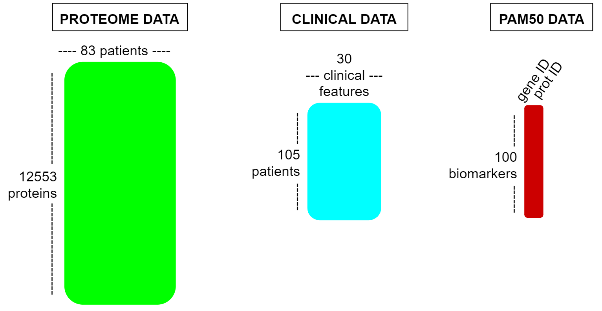
```
[Source: Kaggle](https://www.kaggle.com/piotrgrabo/breastcancerproteomes#clinical_data_breast_cancer.csv)

## Material and Methods {data-background=#ffffff}

```{r,out.width =  "1000px"}
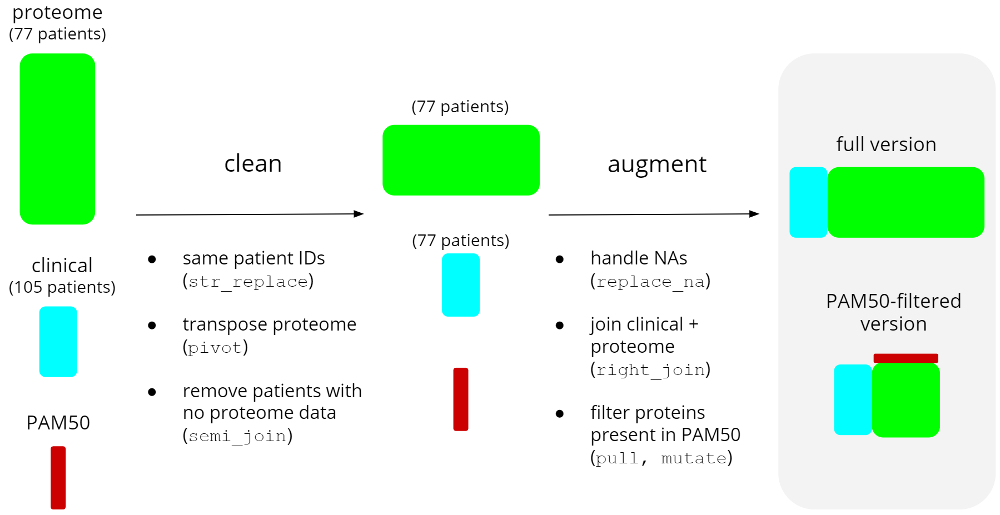
```

## Material and Methods {data-background=#ffffff}


```{r,  out.width =  "600px", fig.align = 'center'}
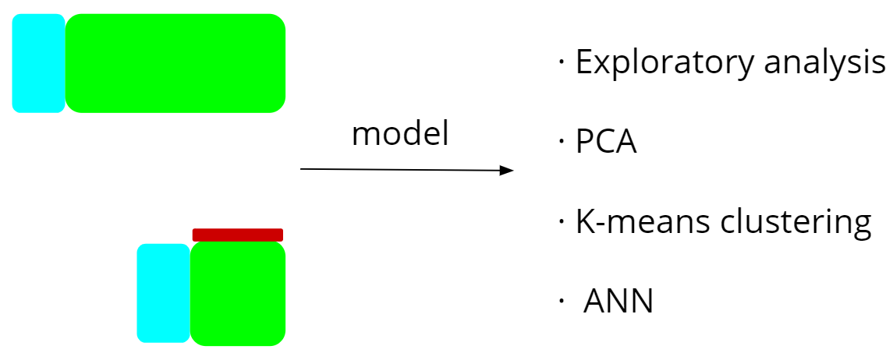
```
  
  
```{r,  out.width =  "600px", fig.align = 'center'}
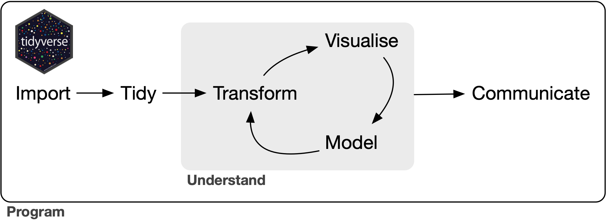
```

## Material and Methods {data-background=#ffffff}
```{r, out.width = "950px", fig.align = 'center'}
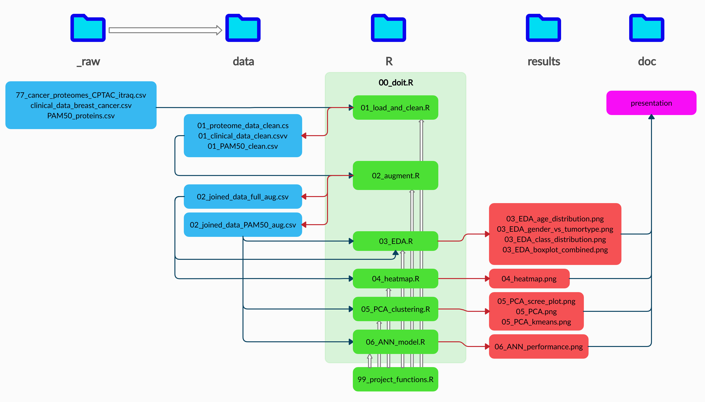
```

## Material and Methods {data-background=#ffffff}
<div style="float: left; width: 50%;">
### Course-related packages

* tidyverse
* broom
* stringr
* patchwork
* keras/tensorflow

</div>
<div style="float: right; width: 50%;">
### Course-unrelated packages
* gridExtra

</div>

## Results --- no outliers on total protein expression {data-background=#ffffff}

```{r,  out.width =  "750px", fig.align = 'center'}
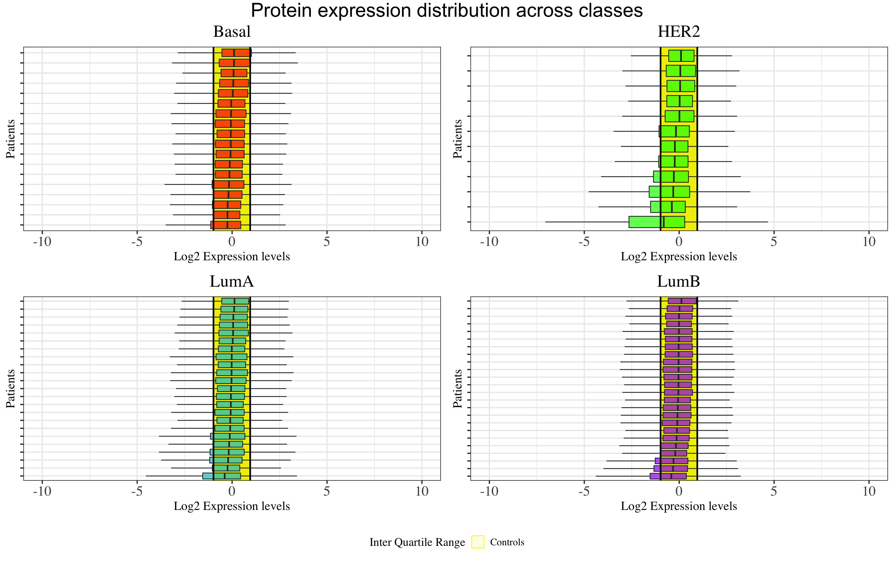
```
[GitHub](https://github.com/rforbiodatascience/2020_group07/blob/master/R/03_EDA.R)

## Results --- breast cancer classes in the dataset are well represented  {data-background=#ffffff}

```{r,  out.width =  "700px", fig.align = 'center'}
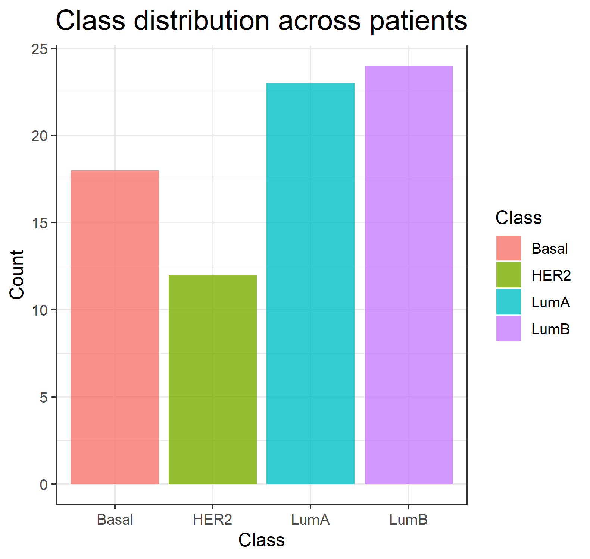
```
[GitHub](https://github.com/rforbiodatascience/2020_group07/blob/master/R/03_EDA.R)

## Results --- breast cancer classes do not discriminate on age {data-background=#ffffff}
```{r,  out.width =  "850px", fig.align = 'center'}
knitr::include_graphics("../results/03_EDA_age_distribution.png")
```
[GitHub](https://github.com/rforbiodatascience/2020_group07/blob/master/R/03_EDA.R)

## Results --- breast cancer and gender {data-background=#ffffff}
```{r,  out.width =  "700px", fig.align = 'center'}
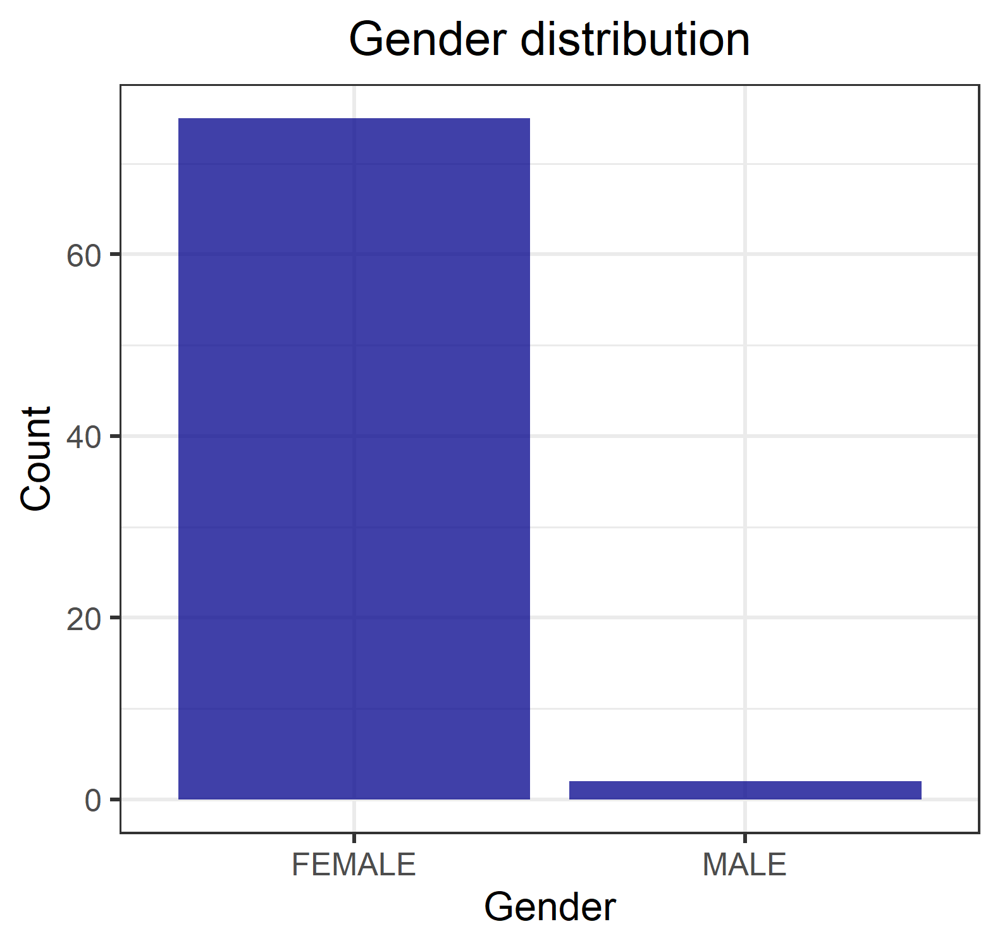
```
[GitHub](https://github.com/rforbiodatascience/2020_group07/blob/master/R/03_EDA.R)

## Results --- protein expression heatmap {data-background=#ffffff}
```{r, out.width =  "750px", fig.align = 'center'}
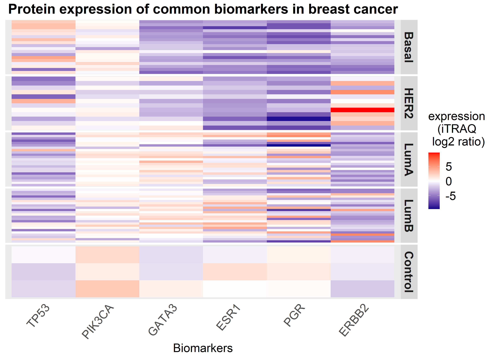
```
[GitHub](https://github.com/rforbiodatascience/2020_group07/blob/master/R/04_heatmap.R)

## Results --- dimensionality reduction {data-background=#ffffff}
```{r, out.width =  "750px"}
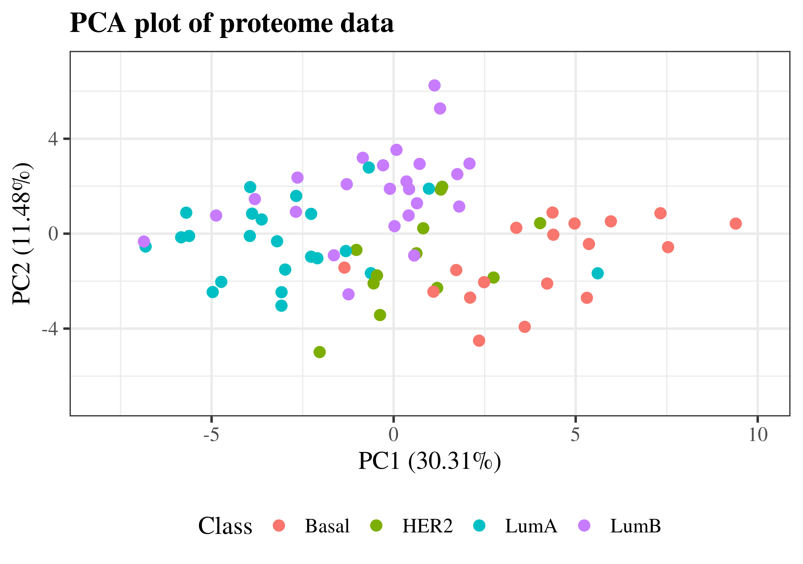
```
[GitHub](https://github.com/rforbiodatascience/2020_group07/blob/master/R/05_PCA_clustering.R)

## Results --- K-means clustering  {data-background=#ffffff}
```{r, out.width =  "830px"}
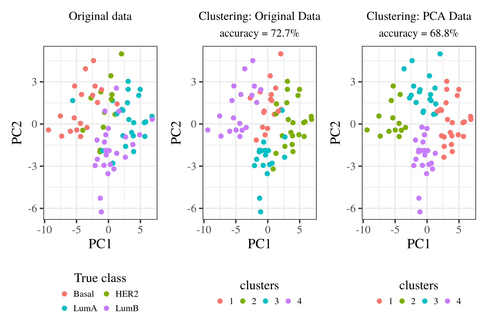
```
[GitHub](https://github.com/rforbiodatascience/2020_group07/blob/master/R/05_PCA_clustering.R)

## Results --- ANN model's structure {data-background=#ffffff}
```{r,out.width = "1000px"}
knitr::include_graphics("../doc/Rmd_sup/ANN_structure.png")
```

## Results --- ANN performance {data-background=#ffffff}
```{r, out.width="700px", fig.align="center"}
knitr::include_graphics("../results/06_ANN_performance.png")
```
[GitHub](https://github.com/rforbiodatascience/2020_group07/blob/master/R/06_ANN_model.R)

## Discussion {data-background=#ffffff}


* K-means clustering Acc.: 72.7% - ANN model Acc.: 82.8%

* Collect more data for building more reliable models

* Combine proteome data with RNAseq data to investigate more associations - network analysis

* Tidyverse R package is a smart and elegant tool for data analysis and visualization


## The end {data-background="Rmd_sup/final2.jpg" data-background-size=cover}

```{r, out.width="100px", fig.align="right"}
#knitr::include_graphics("../doc/Rmd_sup/breast_cancer_logo.jpg")
```


