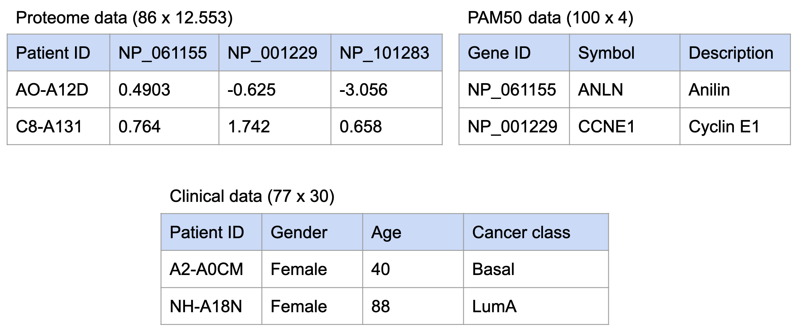

<style>
/* Fonts and Spacing */
article p, article li, article li.build, section p, section li{
  font-family: 'Open Sans','Helvetica', 'Crimson Text', 'Garamond',  'Palatino', sans-serif;
  text-align: justify;
  font-size:20px;
  line-height: 1.0em;
  color: Black;
}
h2 { /* Header 2 */
font-size: 24px;
#color: Black;
}
  
body{ /* Normal */
font-size: 8px;
color: Black;
}
</style>

h2.title {
font-size: 8px;
#color: #a9a9a9;
text-align: center;
}
```{r setup, include=FALSE}
knitr::opts_chunk$set(echo = FALSE, out.width =  "700px", fig.align="center")
```


```{r, echo=FALSE,message=FALSE}
# Clear workspace
# ------------------------------------------------------------------------------
rm(list = ls())

# Load libraries
# ------------------------------------------------------------------------------
library("tidyverse")

```


## Introduction {data-background="Rmd_sup/breast.jpg" data-background-size=cover}
### Data set:

* breast cancer

* proteomics by mass spectrometry

* four classes
  
```{r, out.width =  "40%", fig.align='left'}
knitr::include_graphics("Rmd_sup/classes.png")
```


### Goal:
* Explore the data to identify patterns

* Create models to predict breast cancer class


<!-- ## Materials and Methods: {data-background=#ffffff} -->
<!-- ### Dataset: -->
<!-- ```{r,  out.width =  "800px"} -->
<!--  -->
<!-- ``` -->


## Material and Methods {data-background=#ffffff}

```{r, out.width =  "750px", fig.align='center'}
knitr::include_graphics("Rmd_sup/dataset.png")
```


## Material and Methods {data-background=#ffffff}

```{r,out.width =  "1000px"}
knitr::include_graphics("Rmd_sup/clean_augment.png")
```

## Material and Methods {data-background=#ffffff}

<!-- * Exploratory analysis -->

<!-- * PCA -->

<!-- * K-means -->

<!-- * ANN -->

```{r,  out.width =  "600px", fig.align = 'center'}
knitr::include_graphics("Rmd_sup/models.png")
```
  
  
```{r,  out.width =  "400px", fig.align = 'center'}
knitr::include_graphics("Rmd_sup/DS_steps.PNG")
```

## Material and Methods {data-background=#ffffff}
```{r, out.width = "950px",fig.align = 'center'}
knitr::include_graphics("../doc/Rmd_sup/currentfiles.png")
```


## Results --- no definitive effects between expression landscapes and specific tumor subclasses {data-background=#ffffff}

```{r,  out.width =  "750px"}
knitr::include_graphics("../results/03_EDA_boxplot_combined.png")
```


## Results --- breast cancer subtypes in the dataset are well represented  {data-background=#ffffff}

```{r,  out.width =  "700px"}
knitr::include_graphics("../results/03_EDA_class_distribution.png")
```

## Results --- breast cancer subtypes do not discriminate on age {data-background=#ffffff}
```{r,  out.width =  "700px"}
knitr::include_graphics("../results/03_EDA_age_distribution.png")
```

## Results --- breast cancer and gender {data-background=#ffffff}
```{r,  out.width =  "700px"}
knitr::include_graphics("../results/03_EDA_gender_vs_tumortype.png")
```


## Results --- protein expresion heatmap {data-background=#ffffff}
```{r, out.width =  "700px", fig.pos = "!H"}
knitr::include_graphics("../results/04_heatmap.png")
```

## Results --- dimentionality reduction {data-background=#ffffff}
```{r, out.width =  "600px"}
knitr::include_graphics("../results/05_PCA.png")
```


## Results --- K-means clustering  {data-background=#ffffff}
```{r, out.width =  "800px"}
knitr::include_graphics("../results/05_PCA_kmeans.png")
```

## Results --- ANN model's structure {data-background=#ffffff}
```{r,out.width = "1000px"}
knitr::include_graphics("../doc/Rmd_sup/ANN_structure.png")
```

## Results --- ANN performance {data-background=#ffffff}
```{r, out.width="700px", fig.align="center"}
knitr::include_graphics("../results/06_ANN_performance.png")
```


## Discussion {data-background=#ffffff}


* What could have been better

* further work


## The end {data-background="Rmd_sup/final2.jpg" data-background-size=cover}

```{r, out.width="100px", fig.align="right"}
knitr::include_graphics("../doc/Rmd_sup/breast_cancer_logo.jpg")
```


