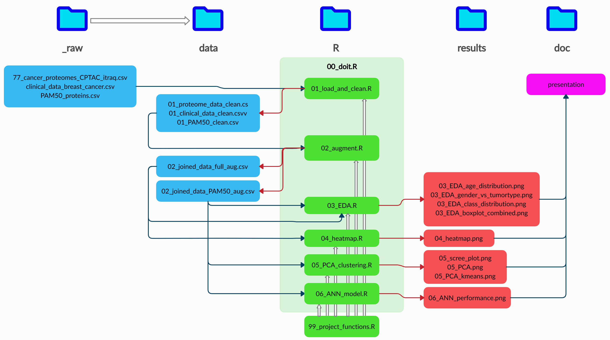

<style>
/* Fonts and Spacing */
article p, article li, article li.build, section p, section li{
  font-family: 'Open Sans','Helvetica', 'Crimson Text', 'Garamond',  'Palatino', sans-serif;
  text-align: justify;
  font-size:20px;
  line-height: 1.5em;
  color: Black;
}
h2 { /* Header 2 */
font-size: 24px;
#color: Black;
}
  
body{ /* Normal */
font-size: 8px;
color: Black;
}
</style>

h2.title {
font-size: 8px;
#color: #a9a9a9;
text-align: center;
}
```{r setup, include=FALSE}
knitr::opts_chunk$set(echo = FALSE, out.width =  "700px", fig.align="center")
```


```{r, echo=FALSE,message=FALSE}
# Clear workspace
# ------------------------------------------------------------------------------
rm(list = ls())

# Load libraries
# ------------------------------------------------------------------------------
library("tidyverse")

# Define functions (DELETE IF NOT USED)
# ------------------------------------------------------------------------------
# Load data
# ------------------------------------------------------------------------------
# 
# df <- read_csv(file = "../data/02_joined_data_aug.csv")
# 
# # check the datasets in tables
# proteome_raw_data <- as_tibble(read_csv(file = "../data/_raw/77_cancer_proteomes_CPTAC_itraq.csv")) # -> rows x cols - 12,553 x 86
# clinical_raw_data <- as_tibble(read_csv(file = "../data/_raw/clinical_data_breast_cancer.csv"))  # -> rows x cols - 105 x 30
# pam50_raw_data <- as_tibble(read_csv(file = "../data/_raw/PAM50_proteins.csv"))
```


## Introduction {data-background="Rmd_sup/breast.jpg" data-background-size=cover}
### Dataset:
* breast cancer

* proteomics by mass spectrometry

### Goal:
* Explore the dataset for patterns

* Create models to identify the breast cancer subclasses


## Materials and Methods
### Dataset:
```{r,  out.width =  "800px"}
knitr::include_graphics("Rmd_sup/datasets.PNG")
```

## Materials and Methods:

* Exploratory analysis

* PCA

* K-means

* ANN

```{r,  out.width =  "800px"}
knitr::include_graphics("Rmd_sup/DS_steps.PNG")
```

## No definitive effects between expression landscapes and specific tumor subclasses

```{r,  out.width =  "750px"}
knitr::include_graphics("../results/03_EDA_boxplot_combined.png")
```


## Breast cancer subtypes in the dataset are well represented

```{r,  out.width =  "770px"}
knitr::include_graphics("../results/03_EDA_class_distribution.png")
```

## Breast cancer subtypes do not discriminate on age

```{r,  out.width =  "770px"}
knitr::include_graphics("../results/03_EDA_age_distribution.png")
```

## Breast cancer and gender

```{r,  out.width =  "770px"}
knitr::include_graphics("../results/03_EDA_gender_vs_tumortype.png")
```

## Heatmap

```{r, out.width =  "700px"}
knitr::include_graphics("../results/04_heatmap.png")
```

## Dimentionality reduction 

```{r, out.width =  "800px"}
knitr::include_graphics("../results/05_PCA.png")
```


## K-means clustering 

```{r, out.width =  "800px"}
knitr::include_graphics("../results/05_PCA_kmeans.png")
```

## ANN model's structure 

```{r,out.width = "1000px"}
knitr::include_graphics("../doc/Rmd_sup/ANN_structure.png")
```

## ANN performance

```{r, out.width="700px", fig.align="center"}
knitr::include_graphics("../results/06_ANN_performance.png")
```


## File structure and reproducibility


```{r, out.width="800px"}

```

## Discussion


* What could have been better

* further work

## The end {data-background="Rmd_sup/final2.jpg" data-background-size=cover}

```{r, out.width="100px", fig.align="right"}
knitr::include_graphics("../doc/Rmd_sup/logo.jpg")
```


